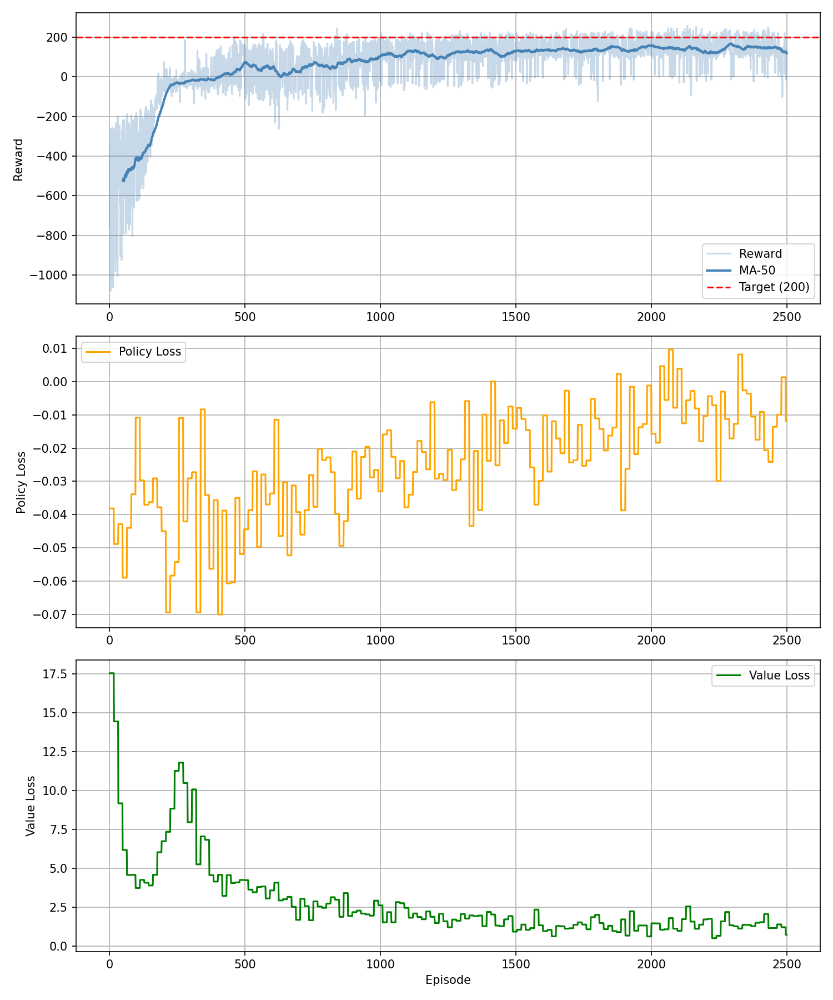

# Assignment 2: REINFORCE with Baseline on LunarLander-v3

**Student ID:** 2022320317  
**Name:** 이윤제  
**Environment:** LunarLander-v3 (Continuous)

---

## 1. Algorithm Description: REINFORCE with Baseline

### 1.1 Overview

REINFORCE with baseline is a policy gradient algorithm that directly optimizes a parameterized stochastic policy by computing the gradient of the expected cumulative return. Unlike value-based methods (e.g., DQN), it learns a policy π_θ(a|s) directly. A baseline—typically an estimated state-value function V(s)—is subtracted from the return to reduce the variance of gradient estimates without introducing bias.

The policy gradient theorem gives the gradient of the objective J(θ) as:

```
∇_θ J(θ) = E_τ [ Σ_t ∇_θ log π_θ(a_t|s_t) · (G_t - b(s_t)) ]
```

where G_t is the discounted return from time step t, and b(s_t) is the baseline (value network output V_φ(s_t)). The difference A_t = G_t - b(s_t) is the advantage, indicating whether the taken action was better or worse than average.

### 1.2 Core Components

#### Actor (Policy Network)
A two-layer MLP (256 → 256 → 2) with Tanh activations that outputs the mean μ(s) of a Gaussian distribution for each of the two continuous action dimensions. The standard deviation σ is a learned state-independent parameter (log_std). Actions are sampled stochastically during training and taken deterministically (using the mean) during evaluation.

```
π_θ(a|s) = N(μ_θ(s), σ_θ²)
```

The mean head is initialized with small weights (std=0.01) to start with a near-uniform policy, and all layers use orthogonal initialization for training stability.

#### Critic (Value Network / Baseline)
A two-layer MLP (256 → 256 → 1) with Tanh activations that estimates the state-value function V_φ(s). The critic is trained separately from the actor using Huber loss over 20 iterations per update to accurately track the current policy's value function. The critic output serves as the baseline b(s_t), reducing gradient variance.

#### Generalized Advantage Estimation (GAE)
Instead of using raw Monte Carlo returns as the advantage, GAE (Schulman et al., 2016) is used to balance bias and variance:

```
A_t^GAE = Σ_{l=0}^{∞} (γλ)^l δ_{t+l},   δ_t = r_t + γV(s_{t+1}) - V(s_t)
```

With γ=0.99 and λ=0.95, GAE provides a smooth trade-off: λ=1 recovers Monte Carlo returns (high variance), and λ=0 recovers the 1-step TD advantage (high bias). λ=0.95 favors low variance while accepting slight bias, which accelerates learning.

### 1.3 Training Procedure

1. **Trajectory Collection:** 16 full episodes are collected using the current stochastic policy before any parameter update. No updates occur during collection.
2. **Advantage Computation:** GAE advantages A_t and returns R_t are computed for each timestep from the collected trajectories.
3. **Advantage Normalization:** Advantages are normalized (zero mean, unit variance) across the batch to stabilize training:
   ```
   Ã_t = (A_t - mean(A)) / (std(A) + ε)
   ```
4. **Actor Update (REINFORCE):** A single gradient step is taken to maximize the policy objective:
   ```
   L_actor = -E[log π_θ(a_t|s_t) · Ã_t] - α_H · H[π_θ]
   ```
   An entropy bonus (α_H annealed from 0.02 → 0.0) encourages early exploration and prevents premature convergence.
5. **Critic Update:** The value network is updated for 20 iterations using Huber loss:
   ```
   L_critic = HuberLoss(V_φ(s_t), R_t)
   ```

### 1.4 Key Hyperparameters

| Parameter | Value | Rationale |
|-----------|-------|-----------|
| Discount factor γ | 0.99 | Long-horizon credit assignment |
| GAE λ | 0.95 | Low-variance advantage estimation |
| Actor LR | 3e-4 | Standard for Adam on PG tasks |
| Critic LR | 1e-3 | Faster value function fitting |
| Critic iterations | 20 | Accurate baseline reduces actor variance |
| Batch size | 16 episodes | Reduces gradient variance vs. single-episode |
| Entropy coeff | 0.02 → 0.0 | Encourages exploration early on |
| Gradient clip | 0.5 | Prevents destructive updates |
| State normalization | RunningMeanStd | Stabilizes input distribution |
| Network activation | Tanh | Bounded outputs, stable with orthogonal init |
| Weight init | Orthogonal | Well-conditioned gradients at start |

---

## 2. Performance Analysis

### 2.1 Training Curve



The training progress is visualized through three metrics: Episode Reward, Policy Loss, and Value Loss. The moving average (MA-50) is used to show the general trend of rewards.

### 2.2 Training Trend Analysis

**Phase 1 — Exploration and Rapid Improvement (Episodes 1–2000):**  
The agent begins with near-random behavior, resulting in consistently low rewards. During this phase, the **Value Loss** is initially high as the critic learns to approximate the return but gradually stabilizes as the baseline becomes more accurate. The **Policy Loss** shows significant fluctuations as the actor receives strong gradient signals from the advantage estimates, leading to the rapid rise in the MA-50 reward curve.

**Phase 2 — Convergence and Stability (Episodes 2000–5000):**  
By around episode 2000, the reward curve approaches the target region of 200. The **Value Loss** remains low and stable, indicating that the critic has effectively learned the state-value function for the current policy. The **Policy Loss** continues to show variance due to the stochastic nature of REINFORCE, but its magnitude remains within a consistent range, confirming that the policy has converged to a stable, high-performing solution.

### 2.3 Characteristics of REINFORCE Training

The training curves exhibit traits characteristic of REINFORCE with baseline:

- **High reward variance:** Individual episode rewards scatter widely, which is inherent to Monte Carlo return estimation.
- **Stable Loss Trends:** Despite the noise in rewards, the Value Loss shows a clear downward trend before stabilizing, which proves the effectiveness of the baseline in reducing gradient variance.
- **Successful Convergence:** The consistent upward trend in the reward MA-50, coupled with stabilized loss curves, demonstrates a robust implementation.

### 2.4 Evaluation Result

After training, the best-saved policy (best_policy.pth, selected by highest avg100 reward) was evaluated deterministically on a single episode:

| Metric | Value |
|--------|-------|
| Evaluation reward | **229.64** |
| Solve threshold (avg100) | 200.0 |

The evaluation reward of **229.64** clearly exceeds the solve threshold of 200, confirming that the agent has learned a robust landing policy. The gap between the average training reward and the evaluation reward is expected: during evaluation, the policy uses deterministic actions (the mean of the Gaussian), which eliminates the stochastic sampling noise present during training and yields more consistent, higher-quality behavior.

---

## 3. Summary

A REINFORCE with baseline agent was successfully trained on LunarLander-v3 (continuous). The key design decisions—GAE for advantage estimation, a separately trained value network as baseline, batched trajectory collection, and online state normalization—collectively reduced the gradient variance enough to achieve reliable convergence. The agent reached an evaluation reward of **229.64**, surpassing the solve criterion of 200.
